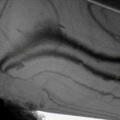
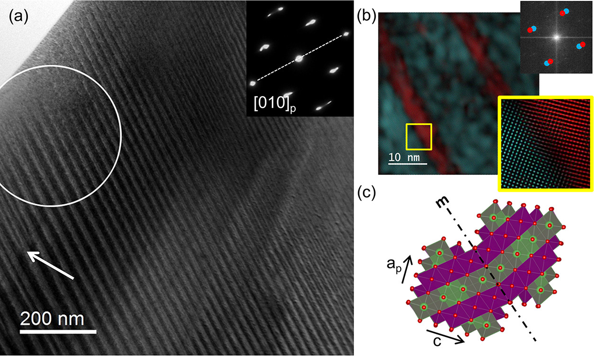

# CSCI_596 Final Project
This project aims to simulate and visualize the dynamic discharging process of a Li2xMn2O4 (0.5<x<1) single particle using phase field modeling. This is a math-heavy project, and detailed derivation and result analysis can be found in our recent paper [Coupling Diffusion and Finite Deformation in Phase Transformation Materials]([https://arxiv.org/abs/2309.01870](https://www.sciencedirect.com/science/article/pii/S0022509623003058)).

# Background
[Experimental findings](https://pubs.acs.org/doi/full/10.1021/acsaem.0c00380) by Erichsen et al. show that during the discharging process, LMO particle not only undergoes volumetric expansion but also generates characteristic texture (i.e., lamellar microstructures). In the subsequent figures, the left side illustrates the dynamic discharging process, while the right side showcases Bragg-filtered HRTEM images of the lamellar microstructure.

 
 
# Tools
C++ codes are implemented using Multiphysics Object-Oriented Simulation Environment ([MOOSE](https://mooseframework.inl.gov/index.html)), simulations are executed on USC CARC, and results are visualized utilizing [Paraview](https://www.paraview.org/).

# Results

For other information about my simulation, please take a look at CSCI596_Final_project.pdf in my repository.
